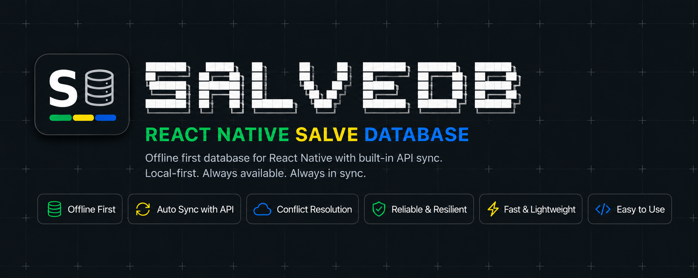
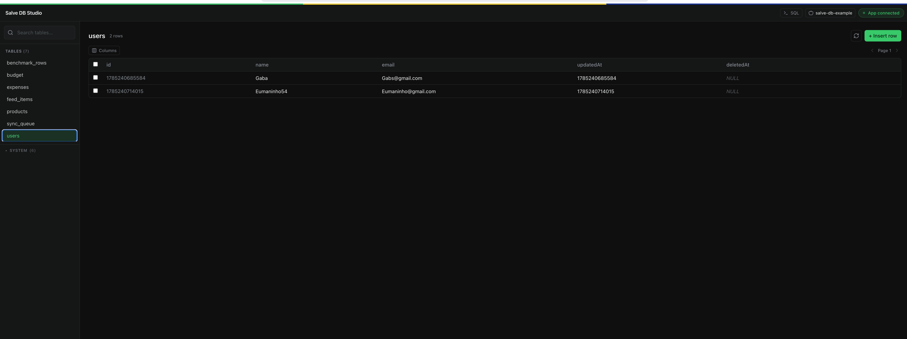
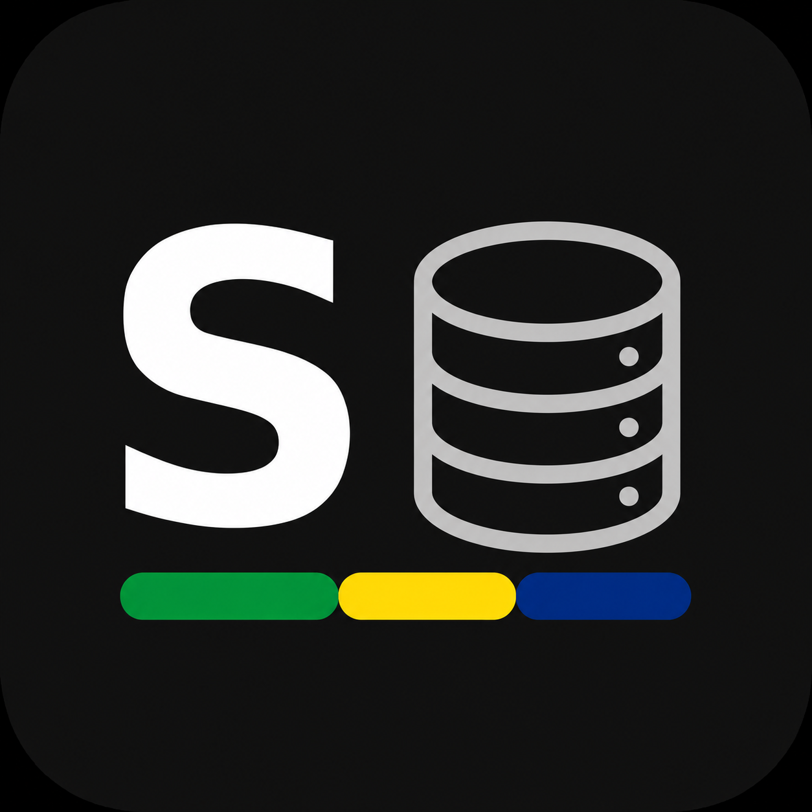

<p align="center">
  
</p>

<h1 align="center">Salve DB</h1>

<p align="center">
  <strong>Offline-first SQLite for React Native with a 100% native sync engine</strong>
</p>

<p align="center">
  
  
  
  
</p>

---

Salve DB is an offline-first SQLite database for React Native. You declare your tables and their REST sync contract as plain TypeScript data; a native C++/Swift/Kotlin core creates the tables, migrates them, installs SQLite triggers that queue every local write, and pushes/pulls against your own REST API — including OAuth2 token refresh — **without the JS engine ever being started**. A background job (`WorkManager` on Android, `BGTaskScheduler` on iOS) wakes the native sync orchestrator on its own; your app doesn't need to be open.

Full docs, architecture, and API reference: **[salve-software.github.io/react-native-salve-db](https://salve-software.github.io/react-native-salve-db)**

In the foreground you get a Drizzle-style typed query builder plus `useQuery` / `useInfiniteQuery` hooks that re-render automatically whenever a table changes — no matter whether the write came from your own code, raw SQL, a migration, or the background sync engine.

## Features

- **Sync runs 100% natively** — the sync orchestrator, HTTP client, credential provider, and background scheduler live entirely in C++/Swift/Kotlin. No JS bundle, no JS thread, no headless task required.
- **Declarative schemas** — tables, indexes, relations, and sync contracts are TypeScript data, interpreted natively. No SQL, no codegen step for schema changes.
- **Automatic sync queue** — every `INSERT`/`UPDATE`/`DELETE` (including raw SQL) is captured by a SQLite trigger and queued for sync; you never call `enqueue` yourself.
- **Typed query builder** — `select`/`insert`/`update`/`delete`/`count`/`transaction`, Drizzle-style `where`/`orderBy`/`limit`/`offset`, fully typed from your schema via `InferSelectModel`/`InferInsertModel`.
- **Reactive hooks** — `useQuery` and `useInfiniteQuery` subscribe to table changes and re-run automatically, with a built-in throttled read-triggered sync.
- **Auto-migrations** — `ADD COLUMN` migrations run automatically on schema version bumps. No DROP/RENAME, no migration files to write.
- **OAuth2 out of the box** — access/refresh tokens stored in Keychain (iOS) / Keystore (Android), refreshed natively, no token juggling in JS.
- **Live Studio** — connect [`salve-db-studio`](packages/salve-db-studio) to browse and edit your running app's database from your terminal-adjacent browser, Prisma/Drizzle Studio style.

## Architecture

```text
┌───────────────────────────────┐        JSI (Nitro Modules)        ┌────────────────────────────────────┐
│      TypeScript (DX layer)      │ ─────────────────────────────────▶ │        Native Core (C++)            │
│                                 │                                    │                                      │
│  Database.configure/register   │                                    │  SQLite + LRU statement cache        │
│  Query Builder (select/insert  │                                    │  Migration Engine (ADD COLUMN)       │
│    /update/delete/transaction) │ ◀───────────────────────────────── │  Trigger Engine → sync_queue         │
│  useQuery / useInfiniteQuery   │        reactive change events      │  Sync Orchestrator (push → pull)     │
│  <SalveDbProvider>              │                                    │  Credential Provider (OAuth2)        │
└───────────────────────────────┘                                    │  HTTP Client                         │
                                                                       └──────────────────┬───────────────────┘
                                                                                          │
                                                              ┌───────────────────────────┴───────────────────────────┐
                                                              │        Swift (iOS) / Kotlin (Android) shims             │
                                                              │  BGTaskScheduler / WorkManager — background scheduler   │
                                                              │  NWPathMonitor / ConnectivityManager — network monitor  │
                                                              │  Keychain / Keystore — secure token storage             │
                                                              └───────────────────────────┬───────────────────────────┘
                                                                                          ▼
                                                                                  Your REST API
```

The background scheduler wakes `SyncNativeEntryPoint` directly from native code — the JS runtime is never started for a background sync pass. In the foreground, the same orchestrator is reachable from JS via `Database.sync()` / `Database.syncAll()`.

## Installation

### Requirements

| Component | Requirement |
|---|---|
| React Native | 0.86+ |
| `react-native-nitro-modules` | 0.36+ |
| Node | 22.11+ |
| Xcode | 15+ (iOS) |
| Android | `minSdk` 23, NDK 27.1.12297006 |

### Install the package

```bash
npm install @salve-software/react-native-salve-db react-native-nitro-modules
```

For iOS, install pods:

```bash
cd ios && pod install && cd ..
```

Android autolinks — a Gradle sync is enough.

### iOS-specific setup

Background sync and the OAuth2 credential provider both need explicit entitlements. Add to your app target:

**`Info.plist`**
```xml
<key>BGTaskSchedulerPermittedIdentifiers</key>
<array>
  <string>com.salvedb.background.sync</string>
</array>
<key>UIBackgroundModes</key>
<array>
  <string>processing</string>
</array>
```

**`*.entitlements`**
```xml
<key>keychain-access-groups</key>
<array>
  <string>$(AppIdentifierPrefix)$(CFBundleIdentifier)</string>
</array>
```

Without these, the app builds and runs fine — the background scheduler just never fires and the credential provider can't persist tokens. There's no runtime error to point you at it, so it's easy to miss.

### Android-specific setup

None. The library declares `INTERNET` and `ACCESS_NETWORK_STATE` in its own manifest and registers the `WorkManager` job automatically.

## Usage

### 1. Define a schema

```ts
import type { ISchemaDefinition } from '@salve-software/react-native-salve-db';

export interface User {
  id: number;
  name: string;
  email: string;
  updatedAt: number;
}

// `satisfies`, never `: ISchemaDefinition<User>` — a type annotation widens
// `columns` and breaks InferSelectModel/InferInsertModel.
export const UserSchema = {
  name: 'users',
  version: 1,
  primaryKey: 'id',
  columns: {
    id: { type: 'integer' },
    name: { type: 'text' },
    email: { type: 'text' },
    updatedAt: { type: 'datetime', nullable: false },
  },
  indexes: [
    { name: 'idx_users_updated_at', columns: ['updatedAt'] },
    { name: 'idx_users_email', columns: ['email'] },
  ],
  sync: {
    enabled: true,
    direction: 'bidirectional',
    conflict: 'lastWriteWins',
    transport: 'rest',
    endpoint: { basePath: '/users', listQueryTemplate: 'updatedAfter={since}&limit={limit}' },
    pagination: { pageSize: 50, maxPagesPerSession: 20 },
  },
} satisfies ISchemaDefinition<User>;
```

`sync` is optional — omit it for local-only tables. `deletedAt` is injected into every table automatically; deletes are soft deletes (`UPDATE ... SET deletedAt = ?`), and reads always exclude it.

### 2. Configure and register

```tsx
import { SalveDbProvider } from '@salve-software/react-native-salve-db';
import { UserSchema } from './schemas/UserSchema';

export default function App() {
  return (
    <SalveDbProvider
      config={{
        name: 'my-app-db',
        baseUrl: 'https://api.myapp.com',
        credentials: {
          provider: 'oauth2',
          // accessToken.headerName/scheme default to "Authorization"/"Bearer" — override for custom APIs.
          tokens: { accessToken, refreshToken },
          refresh: {
            endpoint: '/auth/refresh',
            response: { accessToken: '$.accessToken', refreshToken: '$.refreshToken' },
          },
        },
        background: { minimumInterval: 15 * 60 * 1000, requiresNetwork: true },
      }}
      schemas={[UserSchema]}
    >
      <YourApp />
    </SalveDbProvider>
  );
}
```

`SalveDbProvider` runs `Database.configure` + `Database.register` for you and exposes `{ isReady, isLoading, error }` — or call `Database.configure`/`Database.register` directly if you need more control.

### 3. Query and mutate

```ts
import { Database, eq, and, like } from '@salve-software/react-native-salve-db';

// select — .limit() is mandatory, capped at 500
const users = Database.select(UserSchema)
  .where(and(eq('id', 1), like('email', '%@company.com')))
  .orderBy('updatedAt', 'desc')
  .limit(50)
  .execute();

Database.insert(UserSchema).values({ id: 2, name: 'Ada', email: 'ada@co.com', updatedAt: Date.now() }).execute();
Database.update(UserSchema).set({ name: 'Ada Lovelace' }).where(eq('id', 2)).execute();
Database.delete(UserSchema).where(eq('id', 2)).execute(); // soft delete
Database.count(UserSchema).execute();

Database.transaction((tx) => {
  tx.insert(UserSchema).values(newUser).execute();
  tx.update(BudgetSchema).set({ spentCents: total }).where(eq('id', 1)).execute();
});

// escape hatch for anything the builder doesn't cover (e.g. aggregates)
Database.execute('SELECT COUNT(*) AS total FROM users WHERE email LIKE ?', ['%@company.com']);
```

> Every column used in `where()`/`orderBy()` must be the leading column of a declared index (or the primary key) — query execution is synchronous on the JS thread, so unindexed scans are rejected at call time with a clear error instead of silently blocking the UI.

### 4. React to changes

```tsx
import { useQuery, useInfiniteQuery } from '@salve-software/react-native-salve-db';

function UserList() {
  const { data, isLoading, error } = useQuery({
    schema: UserSchema,
    queryFn: (db) => db.select(UserSchema).where(eq('name', search)).limit(50),
    deps: [search],
  });
  // re-runs automatically on any write to `users`, from any source
}

function UserFeed() {
  const { data, hasNextPage, fetchNextPage } = useInfiniteQuery({
    schema: UserSchema,
    queryFn: (db, { limit, offset }) => db.select(UserSchema).limit(limit).offset(offset),
    pageSize: 20,
  });
}
```

### 5. Sync

Sync runs automatically in the background once configured, and on app open (`syncOnAppOpen`, default `true`). To trigger it manually:

```ts
await Database.sync('users');   // one schema
await Database.syncAll();       // every sync-enabled schema
```

Push drains the local `sync_queue` against `POST/PATCH/DELETE <basePath>[/:id]` (or a custom `itemPathTemplate`); pull pages through `GET <basePath>?<listQueryTemplate rendered>` until a short page signals the end. See [`docs/sync-rest-contract.md`](docs/sync-rest-contract.md) for the full wire contract, and [`packages/salve-db-server`](packages/salve-db-server) for a reference implementation of it.

## Studio

Salve DB ships with a companion **Studio** — a local, live-connected UI (Prisma/Drizzle Studio style) for browsing and editing your running app's database from the browser, without touching the device.

<p align="center">
  
</p>

### Running it

From the repo root:

```bash
npm run db:studio
```

This starts the Studio server ([`packages/salve-db-studio`](packages/salve-db-studio)) — an Express + WebSocket relay on **port 7377** serving a React UI — and opens it in your browser.

Outside this monorepo, run it with `npx salve-db-studio` — no install needed.

### Connecting your app

No extra setup needed on your end: when your app calls `Database.configure(...)` in `__DEV__`, it auto-connects to `ws://localhost:7377` and streams live `change` events as you use the app. Multiple running devices/simulators each show up as a separate entry in the device selector, so you can pick which one to inspect.

From the UI you can:
- Browse every table, including internal `_salve_*` sync tables (queue, cursors, metadata)
- Insert, edit, and delete rows
- Run raw SQL against the live database
- Truncate a table, or drop a non-internal one

## Packages

This is a monorepo with two companion packages alongside the library itself:

- **[`packages/salve-db-studio`](packages/salve-db-studio)** — the Studio described above.
- **[`packages/salve-db-server`](packages/salve-db-server)** — a reference REST backend that implements exactly the sync contract the native engine expects. Read it as the executable spec of "what shape does my API need to be" — it's also what the [`example/`](example) app and the on-device test harness sync against.

## Example app

[`example/`](example) is a full React Native app exercising the library end-to-end across four tabs:

- **Query** — `useQuery` with dynamic filters, a cross-table `Database.transaction`, and a raw-SQL aggregate.
- **Infinite Query** — `useInfiniteQuery`, batch inserts, live pagination reset on write.
- **Benchmark** — bulk insert timing and indexed vs. unindexed query comparison.
- **Sync Test** — real bidirectional sync against `salve-db-server`, with a live `sync_queue` status view.

```bash
cd example
npm install
cd ios && bundle exec pod install && cd ..   # iOS only
npm run ios     # or: npm run android
```

## Testing

| Suite | Command | What it covers |
|---|---|---|
| Native core | `npm run test:native` | C++ engine end-to-end through a real Hermes JSI runtime (Catch2, ~1s, no simulator) |
| TypeScript unit | `npm test` | Query builders, condition compiler, cache, hooks, provider (Jest) |
| On-device harness | `npm run test:harness:ios` / `npm run test:harness:android` | Full JSI stack on a simulator/emulator via `react-native-harness`, including real sync against `salve-db-server` |
| Platform native unit | `npm run test:native:ios` / `npm run test:native:android` | Swift (`swift test`) and Kotlin (Gradle/JUnit) unit tests |

## Contributing

1. Branch off `main`: `feat/{description}` for features, `fix/{description}` for bug fixes.
2. Commit using [Conventional Commits](https://www.conventionalcommits.org/) (`feat`, `fix`, `docs`, `refactor`, `test`, `chore`, ...).
3. Run `npm run test:native` after any change under `cpp/` — it's not optional, and native tests must be updated in lockstep with the code they cover.
4. Run `npm test` and `npm run typecheck` before opening a PR.
5. Open a PR against `main` with a clear description of the change.

## License

MIT © [Salve Software](https://github.com/Salve-Software) — see [`LICENSE`](LICENSE).

---

<p align="center">
  
  Made by Salve Software
</p>
